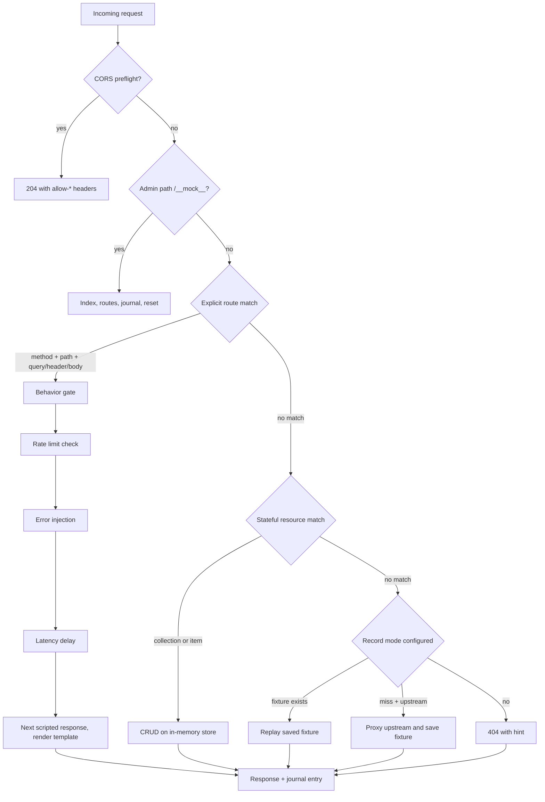

# api-mock-server

**A config-driven mock REST API for frontend dev and testing.** Define endpoints in YAML, get templated dynamic responses, latency and error injection, stateful CRUD resources, OpenAPI import, record-and-replay, config validation with hot reload, and a request journal your e2e tests can assert on — no handler code.


---

## Why

You are building a frontend and the backend does not exist yet. Or it exists but is slow, flaky, or hard to seed into the exact state your UI needs. So you hand-roll an Express server full of `res.json(...)` stubs, and three weeks later it is a second codebase nobody maintains.

`api-mock-server` replaces that with a single YAML file. You declare methods, paths, and responses. You get:

- **Dynamic bodies** — `{{ faker.name }}`, `{{ seq.order }}`, `{{ request.path.id }}` so mock data looks real and varies per call instead of being one frozen fixture.
- **Chaos on purpose** — inject latency and errors to test how your UI behaves on a bad network, seeded so failures are reproducible.
- **Stateful CRUD** — declare a resource and get `GET/POST/PUT/PATCH/DELETE` backed by an in-memory store, so a prototype can actually create and edit records.
- **OpenAPI import** — turn a contract (OpenAPI 3 or Swagger 2) into a runnable mock in one command, with request-aware templates or real CRUD if you ask for them.
- **Record and replay** — proxy a real upstream once, then work offline against saved fixtures.
- **Typos are errors** — `mockserver validate` reports misspelt keys and template expressions with "did you mean" hints, and `serve --watch` applies edits without a restart.
- **Built for e2e suites** — a request journal to assert what the frontend called, a reset endpoint, and scripted response sequences for polling and retry flows.

It is a small, dependency-light Python package on Starlette. The whole thing is driven by config, so a designer or a QA engineer can change a response without touching code.

## How it works

Every request goes through one match pipeline. CORS preflights and the admin
API are answered first; then explicit routes in priority order; then stateful
resources; then record/replay; then a helpful 404. Every non-admin request is
written to the request journal.



Routes are ordered by `priority` descending, then by declaration order, and the **first** route whose method, path, and match conditions all satisfy wins. That is how a specific `/products?category=books` route can shadow the generic `/products` list.

If building a response fails (a broken template, a missing body file), the
answer is a JSON 500 that names the route and the expression, e.g.
`{"error": "mock_error", "route": "bad-route", "expression": "faker.int(a, b)", "detail": "..."}`,
never an opaque "Internal Server Error".

## Quickstart

```bash
git clone https://github.com/AleBrito124356/api-mock-server
cd api-mock-server
pip install -e .                       # or: pip install -r requirements.txt

# Serve one of the bundled examples.
mockserver serve --config examples/shop-api/mocks.yaml
# -> api-mock-server serving examples/shop-api/mocks.yaml on http://127.0.0.1:8000
```

Without installing the package, `python cli.py ...` runs the same CLI straight
from the checkout (`python cli.py serve --config examples/shop-api/mocks.yaml`).

`mockserver --version` prints the installed version.

### Defaults from `.env`

Every `serve` / `replay` / `record` flag has an environment default, so you can
drop the flags you repeat:

```bash
cp .env.example .env      # MOCK_CONFIG, MOCK_HOST, MOCK_PORT, MOCK_SEED, MOCK_UPSTREAM, MOCK_FIXTURES
mockserver serve          # now serves MOCK_CONFIG on MOCK_HOST:MOCK_PORT
```

Precedence, highest first: command-line flag, real environment variable,
`.env` in the current directory (or `--env-file PATH`), built-in default. The
`.env` reader is built in; no extra dependency.

## Usage

### Serve mocks

```bash
mockserver serve --config examples/shop-api/mocks.yaml --port 8000 --seed 7
```

The outputs below are real, from a fresh server with seed 7:

```bash
$ curl -s localhost:8000/products | jq '.results[0]'
{
  "id": 166,
  "name": "Orbit Meadow",
  "price": 327.21,
  "in_stock": true,
  "sku": "vector-signal-474"
}

# A query-specific route wins over the generic list via priority. A route's
# `name` comes back as a header, so you can see which mock answered:
$ curl -s 'localhost:8000/products?category=books' -D - -o /dev/null | grep -i x-matched
x-matched-route: products-books

# Path params flow into the body; single-token templates keep their JSON type:
$ curl -s localhost:8000/products/42 | jq '.id'
42

# Create endpoints can echo the request body and mint ids from a sequence:
$ curl -s -X POST localhost:8000/orders -H 'content-type: application/json' -d '{"item":"Keyboard","qty":2}'
{"id": 1000, "status": "pending", "item": "Keyboard", "qty": 2, "customer": "guest", "created_at": "2026-09-23T11:29:50"}

# Body matching: a zero quantity hits the higher-priority validation route.
$ curl -s -X POST localhost:8000/orders -H 'content-type: application/json' -d '{"item":"Desk","qty":0}'
{"error": "validation_failed", "field": "qty", "message": "qty must be at least 1"}

# Chaos: ~40% of these fail with a 503, seeded so every run is identical:
$ for i in 1 2 3 4 5; do curl -s -o /dev/null -w "%{http_code} " localhost:8000/flaky; done
503 503 200 503 200
```

The same file also has a header-matched `/me` (401 without `Authorization`),
a slow `/recommendations` (150-600 ms), a rate-limited `/search` (the 6th call
in 10 s is a 429 with `Retry-After`), a file-backed `/health`, and a stateful
`/customers` collection. `tests/test_examples.py` runs every one of these
flows, so the examples cannot silently rot again.

### Stateful CRUD

```bash
mockserver serve --config examples/todo-api/mocks.yaml
```

```bash
$ curl -s -X POST localhost:8000/todos \
       -H 'content-type: application/json' -d '{"title":"Wire up the API","done":false}'
{ "title": "Wire up the API", "done": false, "id": 4 }     # 201 Created, Location: /todos/4

$ curl -s 'localhost:8000/todos?done=false&_sort=id&_limit=2'   # filter, sort, paginate
[{"id": 2, "title": "Wire up the API", "done": false}, {"id": 3, "title": "Write the e2e tests", "done": false}]

$ curl -s -X PATCH localhost:8000/todos/4 -d '{"done":true}' -H 'content-type: application/json'
$ curl -s -X DELETE localhost:8000/todos/4 -i                    # 204 No Content

$ curl -s -X POST localhost:8000/todos -H 'content-type: application/json' -d '[1,2,3]'
{"error": "invalid_body", "resource": "todos", "message": "Expected a JSON object, got array."}
```

Listing supports field filters (`?done=false`), `_q` full-text search,
`_sort`/`_order`, `_limit`/`_offset` and `_page`/`_per_page`, and always sends
`X-Total-Count`. A body that is not a JSON object is a 400, and a POST that
reuses an existing id is a 409 instead of silently overwriting it. With
`cors: true` a browser app on another origin can use every method: preflights
are answered, `Origin` is echoed with credentials allowed, and headers such as
`X-Total-Count` and `Location` are exposed to JavaScript.

### Import an OpenAPI spec

```bash
mockserver import-openapi examples/openapi-import/petstore.yaml -o petstore.mocks.yaml
mockserver serve --config petstore.mocks.yaml
curl localhost:8000/v1/pets
```

The importer reads OpenAPI 3.0/3.1 and Swagger 2.0 (YAML or JSON), resolves
`$ref`s, and writes a commented mocks file that it immediately validates.
Status keys can be quoted or bare (`200:`), ranges (`2XX`) or `default`.
Bodies come from response examples, then schema examples, then are synthesized
from the schema, respecting `example`, `default`, `const`, `enum`, `format`,
`pattern` (a matching string is generated, e.g. `^[A-Z]{3}$` gives `ABC`),
`minimum`/`maximum` and their exclusive forms, `multipleOf`,
`minLength`/`maxLength`, `minItems` and nullable types.

| Flag | Effect |
|---|---|
| `--base-path auto` (default) | prefix paths with the path of `servers[0].url` (or Swagger `basePath`): `https://api.petstore.example/v1` makes `/pets` into `/v1/pets`. `--base-path /` keeps the spec's paths. |
| `--dynamic` | templates instead of frozen values: path params echo into the matching field, write operations echo request-body fields, POST ids come from a sequence, formats and field names map to faker (`email`, `uuid`, `date-time`, `uri`, `name`, `city`, `phone`...), numbers stay inside their bounds, enums become `faker.choice(...)`, and array responses get three generated items |
| `--resources` | collection + item pairs (`/pets` and `/pets/{petId}`) become stateful `resources:` seeded from the spec's list example, so writes really persist |

```bash
$ mockserver import-openapi examples/openapi-import/petstore.yaml -o pets.yaml --dynamic
$ mockserver serve --config pets.yaml
$ curl -s localhost:8000/v1/pets/123
{"id": 123, "name": "Noah Brito", "tag": "pixel", "status": "pending", "created_at": "2026-09-23T11:47:49"}

$ mockserver import-openapi examples/openapi-import/petstore.yaml -o pets.yaml --resources
$ mockserver serve --config pets.yaml
$ curl -s -X POST localhost:8000/v1/pets -H 'content-type: application/json' -d '{"name":"Nemo","tag":"fish"}'
{"name": "Nemo", "tag": "fish", "id": 3}                    # 201, Location: /v1/pets/3
```

In Python, `import_openapi(path, base_path=None, dynamic=False, resources=False)`
returns the config dict; its default `base_path=None` keeps the spec's paths,
as in 0.1.x.

### Record and replay

```bash
# Proxy everything unmatched to the real API and save responses as fixtures.
mockserver record --upstream https://api.example.com --fixtures ./fixtures --port 8000

# Later, work offline: replay the same fixtures with no upstream at all.
mockserver replay --fixtures ./fixtures --port 8000

# Or keep your hand-written mocks in front and fall back to the fixtures.
mockserver serve --config mocks.yaml --fixtures ./fixtures
```

Fixtures are plain JSON on disk, one file per distinct request, so they are
easy to inspect, edit, and commit. A request is identified by its method, path,
every query parameter (repeated ones included, order-insensitive) and a hash of
its body, so two POSTs with different payloads get two fixtures. JSON bodies
are hashed in canonical form, so key order and whitespace do not matter.
Fixtures recorded by 0.1.x (no body hash) still replay. A replay miss is a 404
naming the fixture key it looked for; an unreachable upstream is a 502
`upstream_error`, not a hang or an opaque 500.

### Validate and hot-reload

A typo in a hand-edited YAML file should be an error, not a mock that quietly
returns the wrong thing. `mockserver validate` checks keys at every level
(with "did you mean" suggestions), methods, status codes, latency/chaos
ranges, resource settings, that `response.file` exists and parses, and every
`{{ }}` expression (roots, faker helpers and their arguments, filters, and
path params the route actually captures):

```text
$ mockserver validate broken.yaml
broken.yaml: 5 errors
  error    config: unknown key 'sed' (did you mean 'seed'?)
  error    routes[0]: unknown key 'respnse' (did you mean 'response'?)
  error    routes[1].response.status: 700 is not a valid HTTP status (an integer 100-599)
  error    routes[1].response.body.id: path param 'pid' (did you mean 'id'?) is not captured by this route ({id}) in '{{ request.path.pid | int }}'
  error    routes[1].response.body.name: unknown faker helper 'nmae' (did you mean 'name'?) in '{{ faker.nmae }}'
```

It exits 1 on errors (`--strict` also fails on warnings, `--json` prints
machine-readable output), so it is a one-line CI check for your mock files.
`serve`, `replay` and `record` run the same validation first and refuse to
start on errors; `--no-validate` starts anyway.

`mockserver serve --watch` reloads the mocks file, and any `response.file`
it references, when they change, so an edit shows up on the next request
without a restart. Data in stateful resources survives the reload unless that
resource's definition changed, and sequences keep counting. An invalid edit is
rejected: the server logs the problems, keeps serving the last good version,
and lists them under `watch.errors` in `GET /__mock__`.

### Use it from e2e tests: journal, reset, scripted responses

The mock remembers what your frontend called, and can be put back to a known
state between tests. Everything lives under `/__mock__` (move it with
`config.admin_prefix`); admin calls are never journaled themselves.

| Endpoint | What it does |
|---|---|
| `GET /__mock__` | index: routes, resources, record/watch/journal status, admin endpoints |
| `GET /__mock__/routes` | routes in match order, with `hits` and the position of scripted responses |
| `GET /__mock__/requests` | the request journal, oldest first. Filters: `?method=POST`, `?path=/todos/*` (glob), `?route=create-order`, `?status=201`, `?since=<id>`, `?limit=N` |
| `DELETE /__mock__/requests` | clear the journal |
| `POST /__mock__/reset` | resources back to their seed, sequences and faker/chaos RNGs rewound (the same seeded failures replay), rate-limit windows, response scripts, hit counts and the journal cleared |

Each journal entry has the method, path, query (repeated params as lists),
headers, the body (parsed JSON, or text), what matched it (`{"type": "route",
"name": "create-order"}`, a resource operation, a fixture, or `null` for a
404), the status and the duration. The journal keeps the last 500 requests
(`config.journal_size`; `0` turns it off).

A route can also script consecutive calls with `responses:`. With
`sequence: stick` (the default) the last response repeats; with `cycle` it
starts over. Injected chaos errors do not advance the script, and a reset
rewinds it. The shop example's `/exports/{id}` is a polling flow:

```bash
$ for i in 1 2 3 4; do curl -s -o /dev/null -w "%{http_code} " localhost:8000/exports/9; done
202 202 200 200
```

In a Playwright suite (Cypress works the same way with `cy.request`):

```ts
const MOCK = 'http://localhost:8000';

test.beforeEach(async ({ request }) => {
  await request.post(`${MOCK}/__mock__/reset`);   // seed data, sequences, chaos, journal
});

test('checkout places exactly one order', async ({ page, request }) => {
  await page.goto('/checkout');
  await page.getByRole('button', { name: 'Place order' }).click();
  await expect(page.getByText('Order #1000')).toBeVisible();

  const res = await request.get(`${MOCK}/__mock__/requests?route=create-order`);
  const { count, requests } = await res.json();
  expect(count).toBe(1);
  expect(requests[0].body).toMatchObject({ item: 'Keyboard', qty: 2 });
});
```

## mocks.yaml reference

```yaml
config:                     # global settings (all optional)
  seed: 7                   # deterministic faker data + chaos
  cors: true                # CORS headers (Origin echoed, credentials OK) + preflight
  admin_prefix: /__mock__   # where the admin API lives
  journal_size: 500         # requests kept in the journal (0 = off)
  latency:                  # default delay for every route
    fixed_ms: 0
  chaos:                    # default error/rate-limit behavior
    error_rate: 0.0

routes:                     # explicit endpoints, tried first
  - name: product           # optional; sent back as X-Matched-Route, used by the journal
    method: GET             # GET | POST | PUT | PATCH | DELETE | HEAD | OPTIONS | ANY
    path: /products/{id}    # {param} segments are captured
    priority: 10            # higher wins ties; default 0
    match:                  # optional extra conditions
      query: { category: books }   # value, or "*" for "present with any value"
      headers: { X-Api-Version: "2" }
      body: { user: ada }          # subset match against the JSON body
    latency:                # per-route, overrides the global default
      random_ms: [50, 400]
    chaos:
      error_rate: 0.4       # fraction of calls that fail
      error_status: 503
      error_body: { error: upstream_unavailable }
      rate_limit: { limit: 60, window_ms: 60000, status: 429 }
    response:
      status: 200           # or a template: "{{ request.query.code | default(200) }}"
      headers: { Content-Type: application/json }
      body:                 # inline, templated ...
        id: "{{ request.path.id | int }}"
        name: "{{ faker.name }}"
      # file: ./bodies/thing.json   # ... or loaded from a file (also templated)

  - name: job-status        # scripted: consecutive calls get successive responses
    path: /jobs/{id}
    sequence: stick         # stick (repeat the last one, default) | cycle
    responses:
      - { status: 202, body: { state: pending } }
      - { status: 200, body: { state: done } }

resources:                  # in-memory CRUD collections, tried after routes
  - name: todos
    path: /todos
    id_field: id
    id_type: int            # int (auto-increment) or uuid
    seed:
      - { id: 1, title: "First", done: false }

record:                     # optional proxy-and-record block
  upstream: https://api.example.com   # null for offline replay only
  fixtures_dir: fixtures
  record: true
```

### Template helpers

| Expression | Result |
|---|---|
| `{{ request.query.page }}` | query-string value |
| `{{ request.path.id }}` | captured `{id}` path param |
| `{{ request.header.X-Api-Key }}` | request header, case-insensitive |
| `{{ request.body.user.name }}` | nested field from the JSON body |
| `{{ faker.name }}` `faker.email` `faker.uuid` `faker.city` `faker.url` `faker.phone` | fake data (`mockserver validate` lists typos) |
| `{{ faker.int(1, 100) }}` `faker.price(5, 500)` `faker.bool` | typed fakes |
| `{{ faker.choice('a', 'b', 'c') }}` | one of the given values |
| `{{ seq.order }}` `{{ seq.invoice(1000, 5) }}` | incrementing counter |
| `{{ now.iso }}` `now.date` `now.timestamp` | current time |
| `{{ uuid }}` | random uuid4 |
| `{{ env.API_URL }}` | environment variable |
| `{{ 'text' }}` `{{ 42 }}` `{{ true }}` `{{ null }}` | literals |
| `\| default(1) \| int \| float \| upper \| lower \| title \| round(2) \| json` | chained filters |

When a value is exactly one `{{ expr }}`, its native type is preserved — `{{ faker.int(1, 5) }}` yields a JSON number, not a string. Anything else is interpolated into a string, including several tokens: `"{{ faker.first_name }} {{ faker.last_name }}"` or `"id-{{ seq.n }}"`. Non-string bodies (numbers, booleans, `null`) are sent as JSON. An unknown faker helper or filter is reported by `mockserver validate` and, if you start anyway, answered with a JSON `mock_error` naming the expression.

## Project structure

```
api-mock-server/
├── cli.py                         # run straight from a checkout
├── src/mockserver/
│   ├── config.py                  # YAML -> typed model, path compilation
│   ├── server.py                  # ASGI app, match pipeline, admin API, hot reload
│   ├── dynamic.py                 # {{ ... }} parsing/templating + seedable faker
│   ├── behavior.py                # latency, error injection, rate limiting
│   ├── stateful.py                # in-memory CRUD resources
│   ├── journal.py                 # bounded request journal for verification
│   ├── validate.py                # mocks-file validation with did-you-mean hints
│   ├── openapi_import.py          # OpenAPI 3 / Swagger 2 -> mocks (static, dynamic, resources)
│   ├── record.py                  # proxy-and-record / offline replay
│   └── cli.py                     # serve / replay / record / validate / import-openapi
├── examples/                      # shop API, todo API, OpenAPI import
└── tests/                         # one file per feature, all offline (no network, no keys)
```

Run the tests with `pip install -e ".[dev]"` and `pytest`. They need no
network: the record tests use `httpx.MockTransport` as the upstream
(`create_app(config, upstream_transport=...)`), and the CLI tests replace
uvicorn with a stub.

## How it compares

| | api-mock-server | Prism | WireMock | json-server |
|---|---|---|---|---|
| Config format | one YAML file | OpenAPI spec | JSON stub files | JSON db file |
| Works without an OpenAPI spec | yes | no | yes | yes |
| Dynamic templated bodies | faker, sequences, request echo | schema examples only | response templating | limited |
| Match on query/header/**body** | yes | limited | yes | no |
| Latency + error injection | seeded, per-route | via CLI flags | yes | no |
| Stateful CRUD out of the box | yes | no | via scenarios | yes |
| Record and replay | yes | proxy mode | yes | no |
| Request journal + reset API for e2e tests | yes | no | yes | no |
| Runtime | Python / Starlette | Node | Java / JVM | Node |

**Honest take:** if you already have a maintained OpenAPI contract and only need spec-conformant responses, [Prism](https://github.com/stoplightio/prism) validates against the spec and is the better fit. If you live in the JVM or need enterprise matching features, [WireMock](https://github.com/wiremock/wiremock) is more battle-tested. [json-server](https://github.com/typicode/json-server) is the fastest path to plain REST-over-JSON. `api-mock-server` is for when you want **one readable file** that mixes stateful CRUD, hand-crafted dynamic responses, and deliberate chaos — in a Python stack, without a spec as a prerequisite.

## Related projects

- **[fastapi-production-template](https://github.com/AleBrito124356/fastapi-production-template)** — when the mock has served its purpose, build the real async FastAPI backend from this starter.
- **[webhook-toolkit](https://github.com/AleBrito124356/webhook-toolkit)** — the same record-and-replay idea for inbound webhooks: verify, inspect, and replay locally.
- **[nextjs-ai-chat-template](https://github.com/AleBrito124356/nextjs-ai-chat-template)** — a clean Next.js 15 frontend to point at this mock while the backend is still being built.
- **[python-cli-template](https://github.com/AleBrito124356/python-cli-template)** — a batteries-included Typer + Rich CLI starter, for when a tool outgrows the plain `argparse` CLI this project deliberately keeps dependency-free.

## License

MIT — Copyright (c) 2026 Alejandro Brito. See [LICENSE](LICENSE).
